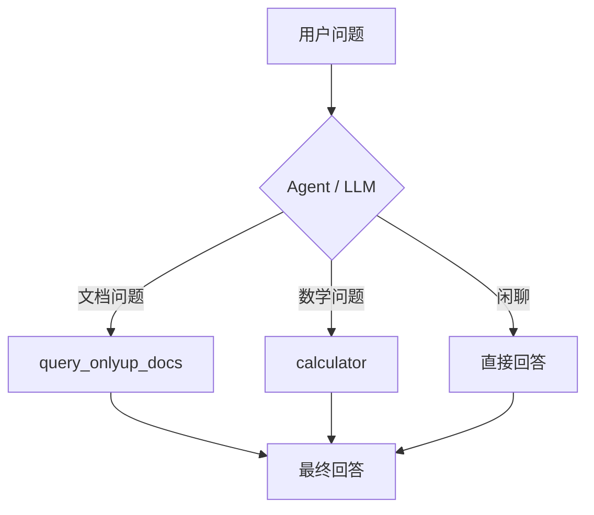

# OnlyUp! RAG Agent 🕹️

基于 **FastAPI + LangChain/LangGraph + ChromaDB** 的 RAG 问答 Agent，回答 OnlyUp! 游戏设计文档相关问题。

A RAG Q&A agent built with **FastAPI + LangChain/LangGraph + ChromaDB** that answers questions from the OnlyUp! game design document.

## 特性 / Features

- 🔍 **混合检索** Hybrid Retrieval：BM25 关键词召回 + ChromaDB 语义向量召回
- 🔀 **RRF 融合** Reciprocal Rank Fusion：合并两路结果、去重
- 🧠 **LLM ReRank**：用 DeepSeek 对候选块重排序，只留 Top-K
- 🛠️ **工具调用 Tool Calling**：Agent 自己决定「查文档」还是「算数学」（v1.1）
- 🤖 **LangGraph 编排**：`create_agent` 构建 ReAct 工具循环
- ⚡ **FastAPI**：`POST /ask` 接口 + 交互式文档

## 目录结构 / Structure

```
onlyup-rag-agent/
├── app/
│   ├── main.py      # FastAPI 入口（/health, /ask）
│   ├── agent.py     # create_agent 工具调用编排（v1.1）
│   ├── tools.py     # 工具集：query_onlyup_docs + calculator（v1.1）
│   ├── rag.py       # 混合检索引擎（Chroma + BM25 + RRF + ReRank）
│   └── config.py    # 配置（API Key、路径、检索参数）
├── data/            # 原始文档（onlyup_design.txt）
├── chroma_db_onlyup/  # ChromaDB 持久化（运行时生成）
├── demo_tools.py    # 工具调用演示脚本（v1.1）
├── requirements.txt
└── .env.example     # 环境变量模板
```

## 工具调用 / Tool Calling

Agent 内置两个工具，由 LLM 根据问题内容**自己决定调用哪个**（或都不调用直接回答）：

| 工具 | 作用 | 触发场景 |
|------|------|----------|
| `query_onlyup_docs` | 查 OnlyUp! 设计文档（RAG 检索 + 生成） | 攀爬/跳跃/关卡/玩法/系统机制等文档问题 |
| `calculator` | 安全计算数学表达式（`ast` 求值，防注入） | 四则运算、幂、取模等 |



**本地演示 / Try it:**
```bash
.venv\Scripts\python.exe demo_tools.py
```
输出会显示每个问题实际使用了哪个工具（`🛠️ 用：[...]`）。

## 快速开始 / Quick Start

```bash
# 1. 创建虚拟环境（Windows）
python -m venv .venv
.venv\Scripts\activate

# 2. 安装依赖
pip install -r requirements.txt

# 3. 配置 API Key
copy .env.example .env        # 填入 DEEPSEEK_API_KEY

# 4. 启动服务
uvicorn app.main:app --reload

# 5. 测试
curl -X POST http://127.0.0.1:8000/ask ^
  -H "Content-Type: application/json" ^
  -d "{\"question\": \"攀爬系统有几个状态？\"}"
```

API 交互式文档：<http://127.0.0.1:8000/docs>

`/ask` 返回体新增了 `tools_used` / `steps` 字段，可以看到 Agent 每一步调了哪个工具、传了什么参数：

```json
{
  "answer": "计算结果为 1039。",
  "tools_used": ["calculator"],
  "steps": [{ "tool": "calculator", "args": {"expression": "2 ** 10 + 5 * 3"}, "result": "2 ** 10 + 5 * 3 = 1039" }]
}
```

## 效果示例 / Demo

浏览器打开 <http://127.0.0.1:8000/docs>，在 Swagger 界面直接提问：


**示例问答**（实际输出见 docs/demo_qa.md）：

> 问：攀爬系统有几个状态？
> 答：见 docs/demo_qa.md

## 说明 / Notes

- DeepSeek 目前**没有 Embedding API**，向量化使用 ChromaDB 内置的本地 ONNX 模型（`ONNXMiniLM_L6_V2`），生成、ReRank 与工具调用走 DeepSeek。
- 模型首次运行会下载（~23MB），之后缓存在本地。
- 踩坑记录见 [PITFALLS.md](PITFALLS.md)。

## Roadmap / 计划

- [x] `create_agent` 接入工具调用（`query_onlyup_docs` + `calculator`）—— v1.1 ✅
- [ ] 更多游戏文档入库
- [ ] 检索质量评估：不同 chunk_size / Top-K 的命中率对比
